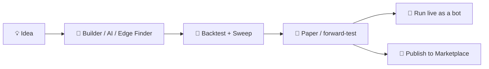

# 🧱 Use Case — Build, Prove & Publish a Strategy

*Turn a trading idea into a tested, automated strategy — and optionally earn from it — without writing code.*

## The flow

### 1 · Get the idea into the Lab

Open **[Strategy Lab](strategy-lab.md)** and choose your path:

* **Builder** — drag indicator blocks (RSI, EMA, MACD, ATR stop, DCA, breakout…) into entry/exit rules.
* **AI Strategist** — describe it in words and let the AI draft it.
* **Edge Finder** — enter only a symbol; AutoML searches strategy families and parameters for what historically worked on that asset.

### 2 · Prove it honestly

Run the **Backtest**: equity curve, profit factor, win-rate, max drawdown, expectancy — net of fees, with **vs-HODL** shown. Use **Sweep** to grid-search parameters and **Compare** to rank candidates. Be skeptical of a perfect curve; robustness across parameters beats a single lucky setting.

### 3 · Forward-test on paper

Promote it to **My Strategies** and let it run on paper. Every paper signal flows into **[Trade History](journal.md)** with the same analytics — so you judge it on *forward* results, not the backtest.

### 4 · Run it live

Happy with the forward record? Run it as a **[bot](bots.md)** on your own connected account (**[connect a broker/exchange](brokers.md)** first). You stay in control — sizing, kill-switch, and full visibility.

### 5 · Publish & earn

Publish to the **Marketplace**: other users subscribe (paid or free) and you earn from subscriptions. Subscribers see your **live** track record, payouts settle on-chain, and KYC/payout rails are built in.


Backtests describe the past. Forward-test before risking capital, size for the drawdown you saw — not the average — and let the live record speak louder than any curve.


***

**Related:** [Strategy Lab reference](strategy-lab.md) · [Bots & Automation](bots.md) · [Find a setup](usecase-find-a-setup.md)
