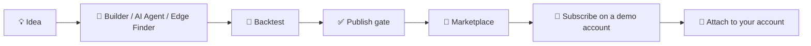

# 🧱 Use Case — Build, Prove & Publish a Strategy

<figure><figcaption></figcaption></figure>

*Turn a trading idea into a tested strategy — and optionally publish it — without writing code. Strategy Lab is part of the Pro and Institutional plans.*

## The flow

```mermaid
flowchart LR
  I["💡 Idea"] --> B["🧱 Builder / AI Agent / Edge Finder"]
  B --> T["🧪 Backtest"]
  T --> G["✅ Publish gate"]
  G --> M["🛒 Marketplace"]
  M --> P["📝 Subscribe on a demo account"]
  P --> R["🦾 Attach to your account"]
```

### 1 · Get the idea into the Lab

Open **[Strategy Lab](strategy-lab.md)** and choose your path:

* **Builder** — stack indicator conditions (RSI, EMA, SMA, MACD, ATR, Bollinger Bands, volume…) into entry rules, then pick exits and the risk block.
* **AI Agent** — describe it in words; the agent maps it to a built-in template, backtests it and gives you the Pine Script.
* **Edge Finder** — enter only a symbol; it scans regimes, then brute-forces a grid of entry/stop/R:R variants with a locked holdout and a walk-forward check.

### 2 · Prove it honestly

Run the backtest: equity curve, win rate, profit factor, expectancy and max drawdown, with your fee setting applied (Edge Finder also nets out funding and shows **vs-HODL**). Use **Compare** to put catalog strategies side by side. Be skeptical of a perfect curve; robustness across parameters beats a single lucky setting.

### 3 · Pass the publish gate

Save the strategy, then publish it. Publishing re-runs a 365-day backtest with an in-sample / out-of-sample check (≥ 30 trades, drawdown ≤ 30%, positive expectancy, profit factor ≥ 1.1, positive out-of-sample expectancy). Once it passes, the signal worker runs it on fresh candles and its forward record appears in **[Trades History](trades-history.md)** — so you judge it on *forward* results, not the backtest.

### 4 · Run it

From the **Marketplace**, subscribe to a strategy and manage it in **Subscriptions**. Subscribing attaches it to a connected **[exchange account](brokers.md)** — start with a demo account; a live account counts toward your plan's live-bot limit. See **[Bots & Automation](bots.md)**.

### 5 · Publish & earn

Listings can be free or paid. Paid listings need an approved Partner (KYC) application on the **Author** page, where you also see subscribers, earnings and payouts. Compare historical tests with forward outcomes before choosing a strategy.


Backtests describe the past. Forward-test before risking capital, size for the drawdown you saw — not the average — and let the forward record speak louder than any curve.


***

**Related:** [Strategy Lab reference](strategy-lab.md) · [Bots & Automation](bots.md) · [Find a setup](usecase-find-a-setup.md)
