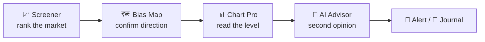

# 🎯 Use Case — Find a Trade Setup

*A repeatable workflow for "what should I look at today?" — using only the free-tier tools.*

## The flow

### 1 · Rank the market

Open the **[Screener](screener.md)**, sort by **Score**, filter to your asset class and timeframe. You now have the handful of pairs where momentum, volume and positioning agree — instead of staring at 500 charts.

### 2 · Confirm the direction

Switch to the **Bias Map**. If a pair scores long on the Screener *and* the multi-timeframe heatmap is green across 5m→1d with a high anchor score, that's confluence. If timeframes disagree (mixed colors), it's a lower-quality setup — skip or wait.

### 3 · Read the actual level

Click the pair into **[Chart Pro](chart-pro.md)**. Use the order-flow **Workspace** — volume profile, footprint, DOM — to find where price actually reacts, and place your entry / stop around real structure, not a round number.

### 4 · Get a second opinion

Send it to the **[AI Advisor](smart-trading.md)** or drop a screenshot into **[Trade Vision](trade-vision.md)** for an independent entry / stop / take-profit read. Cross-check sentiment on **[Pulse](pulse.md)** — is the crowd already all-in the same direction (crowded), or are the accounts that actually *call it right* leaning your way?

### 5 · Commit & track

Set a **[Signal alert](smart-trading.md)** so you don't have to babysit the chart, and log the idea in the **[Journal](journal.md)**. Over time the Journal tells you which setups *you* actually make money on.


The point isn't more signals — it's **fewer, higher-confluence** ones. Each step above is a filter that removes a weak setup before it costs you.


***

**Related:** [Build & publish a strategy](usecase-build-strategy.md) · [Follow the voices that call it right](usecase-follow-voices.md)
