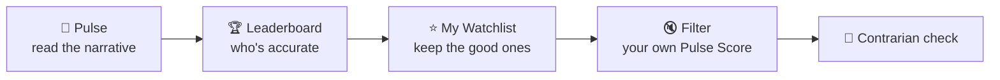

# 📡 Use Case — Follow the Voices That Actually Call It Right

*Crypto X and YouTube are full of confident calls. Formion turns that noise into a measurable signal — and shows you who to ignore.*

## The flow

### 1 · Read the narrative

Open **[Formion Pulse](pulse.md)**. The **Pulse Score** blends X traders, YouTube influencers, social chatter and BTC bias into one 0–100 read. Even bare chart screenshots get **read by a vision model** ("CHART READ") so a picture-only post still counts.

### 2 · See who's actually right

Scroll to the **Accuracy Leaderboard**. Every bull/bear call is checked against real price at +24h / +72h / +7d. The loudest account isn't the best — the **hit-rate and average edge** columns are. The crowd screaming "crash to 50k" while price recovers shows up as a column of misses.

### 3 · Keep the good ones

Add your favourites to **My Watchlist** (`@handle` or a YouTube channel) — they get the same AI scoring on a personal desk. Let **auto-discovery** (🔍) surface new candidates from mentions and an AI-vetted X-search sweep, and **+ Track** the ones worth watching.

### 4 · Make it *your* sentiment

Use the **Source filter** to mute anyone you don't rate. The Pulse Score, desks and leaderboard **recompute instantly for you** — so the number reflects only the voices you trust, not a generic average.

### 5 · Trade the disagreement

The biggest edge is often *contrarian*: extreme fear in the narrative while price holds = the crowd is offside. Pulse runs a transparent **contrarian paper strategy** on exactly this, tracked in **[Trade History](journal.md)**, so you can see whether fading the consensus actually pays.


Sentiment is context, not a trigger. Pair Pulse with the [Screener](screener.md) and your own analysis — and trust the leaderboard over the loudest voice.


***

**Related:** [Formion Pulse reference](pulse.md) · [Find a setup](usecase-find-a-setup.md)
