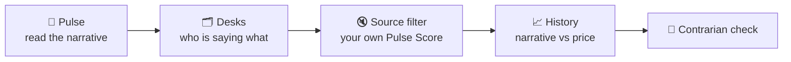

# 📡 Use Case — Follow the Right Voices

<figure><figcaption></figcaption></figure>

*Crypto X and YouTube are full of confident calls. Formion Pulse turns that noise into one readable score — and lets you decide whose voice counts.*

## The flow

```mermaid
flowchart LR
  P["📡 Pulse<br/>read the narrative"] --> D["🗂️ Desks<br/>who is saying what"]
  D --> F["🔇 Source filter<br/>your own Pulse Score"]
  F --> H["📈 History<br/>narrative vs price"]
  H --> C["🎯 Contrarian check"]
```

### 1 · Read the narrative

Open **[Formion Pulse](pulse.md)** (app.formion.ai → Analytics → Pulse). The **Pulse Score** blends X traders, YouTube influencers, crowd and social chatter, Fear & Greed and BTC bias into one 0–100 read. Even bare chart screenshots get **read by a vision model** ("CHART READ") so a picture-only post still counts.

### 2 · See who is saying what

Scroll through the **X desk**, the **YouTube influencer desk** and the **Crowd** card. Each post is read for a bull/bear stance, the asset and the thesis, so you can see whether the score is driven by a few loud accounts or a broad shift.

### 3 · Make it *your* sentiment

Use the **Source filter** to mute anyone you don't rate. The Pulse Score and desks **recompute instantly for you** — so the number reflects only the voices you trust, not a generic average. Your selection is remembered on your device.

### 4 · Check it against price

The **Sentiment-vs-Price history** plots the Pulse Score against the BTC price over the last 30 days, and the **BTC Bias** card shows price momentum. Does the narrative lead the market, or just chase it?

### 5 · Trade the disagreement

The biggest edge is often *contrarian*: extreme fear in the narrative while price holds can mean the crowd is offside. Treat that as a hypothesis to check with the [Screener](screener.md) and your own analysis — not as a signal on its own.


Sentiment is context, not a trigger. Pair Pulse with the [Screener](screener.md) and your own analysis before trusting any voice.


***

**Related:** [Formion Pulse reference](pulse.md) · [Find a setup](usecase-find-a-setup.md)
